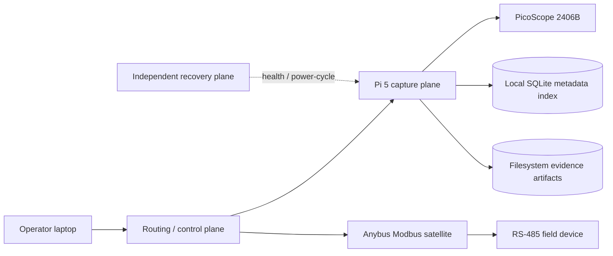

# Remote Dan Lite

Remote Dan Lite is a headless field-diagnostic sidecar for network-controlled PicoScope capture, evidence packaging, and session-centered troubleshooting workflows.

The appliance stays connected to the machine while the technician keeps a normal laptop as the operator surface. Its job is not to claim a diagnosis. Its job is to preserve trustworthy raw evidence, derived measurements, timing context, and operator findings in one durable session.

<p align="center">
  <a href="docs/remote-dan-lite-v1-concept.html">
    
  </a>
</p>

<p align="center">
  <a href="docs/remote-dan-lite-v1-concept.html"><strong>Open the self-contained Remote Dan Lite v1 concept document</strong></a>
  ·
  <a href="docs/architecture.md"><strong>Read the architecture and status boundaries</strong></a>
</p>

## Current project truth

This repository deliberately separates proven behavior from source-complete and designed behavior.

| Area | Status | Honest boundary |
|---|---|---|
| Pi 5 + PicoScope 2406B network capture | **Proven** | Hardware acquisition has produced bounded VBAT/CAN captures and downloadable evidence packages. |
| Artifact generation | **Proven** | Each run produces CSV, JSON, PNG, PDF, and a checksum manifest. |
| SQLite evidence index | **Implemented and tested in this repository** | The schema and repository preserve lineage, but the currently deployed appliance runtime still needs a governed rollout of this source revision. |
| Session-centered tabs | **Designed** | The information architecture is approved; the current web console remains a single-page capture surface. |
| Anybus AB7702 Modbus satellite | **Connected satellite** | The gateway is configured and reachable for Modbus TCP/RTU. Remote Dan API/UI integration is still pending. |
| OOB recovery node and field enclosure | **Architecture target** | These remain part of the three-plane appliance design, not a claim that the finished enclosure is commissioned. |

## Evidence produced today

A bounded Pico capture creates a timestamped evidence directory containing:

- `capture.csv` — raw time, VBAT, CAN-H, CAN-L, differential, and common-mode samples
- `summary.json` — channel statistics and derived bus measurements
- `overview.png` — quick visual review
- `report.pdf` — Field Journal report artifact
- `manifest.json` — run identity, backend, channels, artifact list, and SHA-256 checksums

Simulator data is always labeled `simulator`. Hardware mode fails closed when the native PS2000A driver or Pico USB device is unavailable.

## Architecture



The default product split is intentional:

1. **Capture plane** — Pico acquisition, artifact generation, local web UI, evidence indexing, and timestamp correlation.
2. **Routing/control plane** — predictable service networking, laptop access, uplink, and target-device adjacency.
3. **Recovery/OOB plane** — independent health checks and bounded power-cycle authority over the capture node.
4. **Protocol satellites** — external adapters such as the Anybus gateway. They extend the session without pretending every electrical standard belongs inside the capture computer.

See [`docs/architecture.md`](docs/architecture.md) for the full status vocabulary, tab map, evidence model, and Modbus boundary.

## Planned operator surface

The approved primary navigation is:

`Overview · Scope · Serial · CAN · Tests · Timeline · Evidence`

Connections and System remain secondary setup surfaces. Tabs configure or inspect one synchronized diagnostic session; they do not create separate acquisition implementations.

Guided tests such as relative compression and cylinder contribution belong under **Tests**. They configure reusable capture engines and preserve the raw evidence, calculations, confidence, and operator interpretation.

## Evidence database

SQLite schema version 1 records:

- assets/machines
- diagnostic cases
- sessions
- captures
- artifacts
- channel configuration
- event markers
- structured test results

The durable lineage is:

```text
asset → diagnostic case → session → capture → artifact
```

SQLite stores metadata and relationships. Large evidence bytes remain ordinary files and are referenced by database ID, relative path, media type, byte size, and SHA-256 checksum.

`GET /api/evidence/captures/{capture_id}` returns a capture with its asset/case/session lineage and artifact records.

## Modbus satellite boundary

The Anybus gateway is an external LAN satellite for structured Modbus TCP-to-RTU transactions. It is not a replacement for raw serial evidence.

Remote Dan integration should:

- begin read-only
- route through the authenticated sidecar API
- keep unauthenticated Modbus TCP/502 off public ingress
- log target, function, address/range, result, timing, and error classification
- require an explicit bounded unlock for future writes
- retain a direct isolated RS-485 or scope tap for levels, byte timing, CRC faults, collisions, and non-Modbus traffic

## Capture backends

- `simulator` — deterministic VBAT and complementary CAN-H/CAN-L traces for tests and demonstrations
- `auto` — selects hardware only when the native PS2000A library and a Pico USB device are visible; otherwise uses the visibly labeled simulator
- `hardware` — uses the connected PicoScope 2406B and fails closed when the native driver or device is missing

### Pi 5 ARM64 driver

The prototype uses the native ARM64 `libps2000a` package from PicoScope 7 Early Access and exposes it through the system dynamic-linker cache. Importing the Python wrapper alone is not considered hardware readiness; the driver, USB device, open-unit probe, acquisition, artifact generation, and download path are separate gates.

## Run locally

```bash
python3 -m venv .venv
.venv/bin/pip install -e '.[test]'
.venv/bin/pytest -q

REMOTE_DAN_DATA_DIR=/tmp/remote-dan-lite/captures \
REMOTE_DAN_DB_PATH=/tmp/remote-dan-lite/remote-dan.sqlite3 \
.venv/bin/remote-dan-lite
```

Open `http://127.0.0.1:8776/`.

## Repository layout

```text
remote_dan/                 FastAPI service, capture engines, SQLite repository
remote_dan/static/          Current Traceworks web console
tests/                      API, capture, artifact, and database tests
deploy/                     Example systemd and private-ingress configuration
docs/                       Architecture notes and self-contained visual concept
```

## Deployment boundary

`deploy/remote-dan-lite.service` is an example production unit. It runs as the dedicated `remotedan` account, writes evidence under `/var/lib/remote-dan-lite/captures`, and places the SQLite index at `/var/lib/remote-dan-lite/remote-dan.sqlite3`.

`deploy/rem-01.traefik.yml` is a sanitized private-ingress example. Replace its example hostname, backend, and allowlist. Keep the raw application listener on a private service network rather than exposing port `8776` directly to the public Internet.

Recommended access order:

1. wired Ethernet for primary capture and artifact transfer
2. predictable direct laptop/service networking
3. saved Wi-Fi as an underlay fallback
4. a private overlay such as Tailscale for management
5. authenticated reverse proxy for browser publication

## Development checks

```bash
.venv/bin/pytest tests/ -q
.venv/bin/python -m compileall -q remote_dan tests
git diff --check
```

## Roadmap

- [x] deterministic simulator and bounded capture presets
- [x] real PicoScope 2406B acquisition on Pi 5 ARM64
- [x] CSV/JSON/PNG/PDF/checksum evidence package
- [x] SQLite schema and capture/artifact lineage in governed source
- [ ] deploy the database-backed source revision to the appliance
- [ ] session/asset/case APIs and dashboard selectors
- [ ] tabbed Overview, Scope, Serial, CAN, Tests, Timeline, and Evidence UI
- [ ] digital VBAT presentation alongside CAN waveform review
- [ ] read-only Anybus Modbus satellite integration and transaction logging
- [ ] synchronized serial/CAN/event-marker correlation
- [ ] guided relative-compression and cylinder-contribution workflows
- [ ] independent recovery/OOB hardware and final field enclosure

## License

No open-source license has been selected yet. Public visibility does not grant permission to copy, modify, or redistribute the project; normal copyright rules apply until a license is added deliberately.
