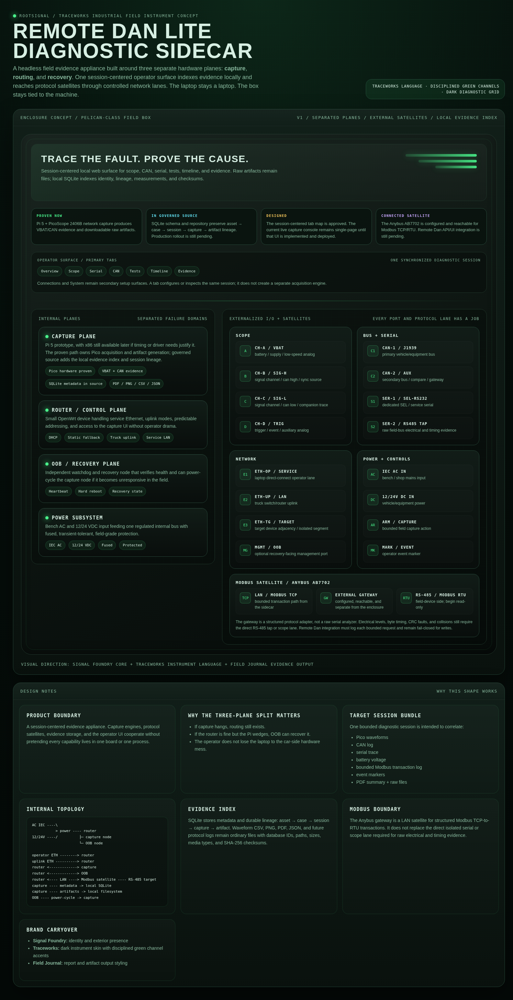
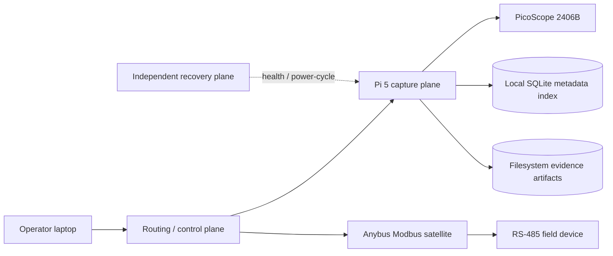

# Remote Dan Lite

Remote Dan Lite is a headless field-diagnostic sidecar for network-controlled PicoScope capture, evidence packaging, and session-centered troubleshooting workflows.

The appliance stays connected to the machine while the technician keeps a normal laptop as the operator surface. Its job is not to claim a diagnosis. Its job is to preserve trustworthy raw evidence, derived measurements, timing context, and operator findings in one durable session.

<p align="center">
  <a href="docs/assets/remote-dan-lite-v1-concept.png">
    
  </a>
</p>

<p align="center">
  <a href="docs/assets/remote-dan-lite-v1-concept.png"><strong>View the full-resolution Remote Dan Lite v1 concept</strong></a>
  ·
  <a href="docs/architecture.md"><strong>Read the architecture and status boundaries</strong></a>
</p>

## Current project truth

This repository deliberately separates proven behavior from source-complete and designed behavior.

| Area | Status | Honest boundary |
|---|---|---|
| Pi 5 + PicoScope 2406B network capture | **Proven** | Hardware acquisition has produced bounded VBAT/CAN captures and downloadable evidence packages. |
| Passive CAN signal intelligence | **Hardware-path proven** | The 2406B sustained a 250,000-sample, three-channel analysis capture at a negotiated 0.104 µs interval with no overflow. Load, bitrate, frame format, identifier width, and CRC-gated protocol fingerprints are persisted with explicit confidence. |
| Configurable Scope workspace | **Hardware-preflight proven** | The real 2406B accepted profile-driven A–D enable state, AC/DC coupling, ±20 mV through ±20 V input ranges, 1:1/10:1/20:1 scaling, and a 10-second 250,000-sample capture. Secondary ignition requires a capacitive pickup and never a direct secondary connection. |
| Artifact generation | **Proven** | Each run produces CSV, JSON, PNG, PDF, and a checksum manifest. |
| SQLite evidence index | **Proven live** | The appliance preserves capture/artifact lineage locally while waveform and report files remain ordinary filesystem artifacts. |
| Passive Serial receive lane | **In governed source; simulator proven** | RX-only capture, termios framing, raw/timing evidence, SQLite lineage, and conservative SEL ASCII, SEL Fast Message, Modbus RTU, DNP3, and IEC-101 fingerprints are tested. The C662 is discovered on the appliance, but the first real receive capture remains a commissioning gate. |
| Passive Bus Sniffer | **In governed source; simulator proven** | Three bounded scope windows, fail-closed safety attestations, cross-window CAN/UART/analog evidence, and compatible-lane recommendations are tested. Real protected-input and Pico acceptance remain commissioning gates. |
| Session-centered tabs | **Core proven live; expansion source-complete** | Overview, Scope, Serial, CAN, Tests, Timeline, and Evidence are deployed. Bus Sniffer and Modbus are source-complete and simulator-proven but not claimed deployed until appliance acceptance. |
| Anybus AB7702 Modbus satellite | **Connected satellite; integration simulator-proven** | The gateway is configured and reachable for Modbus TCP/RTU. Bounded interface-selected HICP plus Modbus 43/14 discovery, transaction evidence, and UI are implemented; the first real on-network discovery remains an explicit acceptance gate. |
| OOB recovery node and field enclosure | **Architecture target** | These remain part of the three-plane appliance design, not a claim that the finished enclosure is commissioned. |

## Evidence produced today

A bounded Pico capture creates a timestamped evidence directory containing:

- `capture.csv` — raw time and enabled engineering-unit channels; network captures also retain VBAT, CAN-H, CAN-L, differential, and common mode
- `summary.json` — channel statistics, profile/channel configuration, overflow state, and network-derived measurements; analysis-grade CAN captures add load, nominal/data rate, frame format, CRC-valid header count, protocol fingerprint, and confidence
- `overview.png` — quick visual review
- `report.pdf` — Field Journal report artifact
- `manifest.json` — run identity, backend, channels, artifact list, and SHA-256 checksums

Simulator data is always labeled `simulator`. Hardware mode fails closed when the native PS2000A driver or Pico USB device is unavailable.

A Serial run produces `capture.bin`, timestamped `chunks.jsonl`, `transcript.txt`, `summary.json`, `overview.png`, `report.pdf`, and `manifest.json`. `capture.bin` preserves the original PARMRK stream; decoded bytes and error markers remain distinguishable in the timing sidecar.

A Bus Sniffer run produces fast/context/sparse waveform CSVs, segment and acquisition provenance, classifier evidence, PNG/PDF review artifacts, and a checksum manifest. Hardware mode requires recorded low-voltage, common-reference, probe-rating, and passive-only attestations. Simulator graphics are visibly marked **SIMULATED EVIDENCE**.

A Modbus discovery run produces `devices.csv`, `transactions.jsonl`, `scan.json`, PNG/PDF review artifacts, and a checksum manifest. Discovery is constrained to one selected connected RFC1918/link-local interface, at most 254 hosts, four workers by default, one HICP broadcast, and one Modbus 43/14 request per remaining candidate. There are no retries, register reads, or register writes.

## Architecture



The default product split is intentional:

1. **Capture plane** — Pico acquisition, artifact generation, local web UI, evidence indexing, and timestamp correlation.
2. **Routing/control plane** — predictable service networking, laptop access, uplink, and target-device adjacency.
3. **Recovery/OOB plane** — independent health checks and bounded power-cycle authority over the capture node.
4. **Protocol satellites** — external adapters such as the Anybus gateway. They extend the session without pretending every electrical standard belongs inside the capture computer.

See [`docs/architecture.md`](docs/architecture.md) for the full status vocabulary, tab map, evidence model, and Modbus boundary.

## Console tour

<a href="https://dandckr-ops.github.io/remote-dan-lite/console-tour.html" target="_blank" rel="noopener noreferrer">Open the interactive console tour</a> for a GitHub-friendly, self-contained documentation preview of all nine primary workspaces. It uses representative data and supports tab buttons, keyboard navigation, and hash deep links, but it is **not** the live appliance: it makes no appliance API calls and cannot access hardware, start captures, scan networks, or change routing.

## Operator surface

The implemented primary navigation is:

`Overview · Bus Sniffer · Scope · Serial · CAN · Modbus · Tests · Timeline · Evidence`

Connections and System remain secondary setup surfaces. Tabs configure or inspect one synchronized diagnostic session; they do not create separate acquisition implementations.

**Scope** is the configurable physical-signal workspace. It provides General, Secondary ignition pickup, Crankshaft VR, Crankshaft Hall, and Injector primary starting profiles; 40 ms through 10 s windows; four channel enable/label controls; AC/DC coupling; model-proven input ranges; probe scaling; and bounded next-capture auto-range suggestions.

**CAN** owns the fixed commissioned network harness and its VBAT/CAN-H/CAN-L measurements. Its analysis window samples the passive pair at approximately 10 MS/s and reports observed occupancy, nominal bitrate, CAN versus CAN FD header evidence, BRS data rate when resolvable, identifier width, frame activity, physical-layer measurements, and confidence-ranked protocol fingerprints. J1939, NMEA 2000, OBD-II/ISO-TP, and CANopen names require CRC-valid Classical CAN frames plus their identifier/PGN patterns; bitrate or voltage shape alone is never treated as proof. A Scope capture no longer replaces CAN state, and a CAN capture no longer replaces the latest Scope waveform.

**Bus Sniffer** is a passive electrical-classification gate, not an active discovery tool. It reconciles bounded fast, context, and sparse windows; requires repeatable framing before medium-confidence UART-family claims; fails closed on silence, clipping, periodic-clock lookalikes, and contradictory evidence; and only opens an existing workspace when its physical input lane is actually compatible. RS-485/422, RS-232, TTL, and 12 V single-wire candidates remain blocked until an appropriate receive-only interface is commissioned.

**Modbus** performs manually initiated network identity discovery only. The operator selects a connected interface/subnet. HICP observations remain explicitly unauthenticated, foreign/conflicting addresses are retained without follow-up, and per-host outcomes preserve refused, timed-out, malformed, exception, and identity-confirmed results. The current tab does not expose arbitrary register reads or any write path.

**Serial** is receive-only in the application. It opens the exact C662 `/dev/serial/by-id` identity with `O_RDONLY`, raw mode, exclusive tty ownership, no software/hardware flow control, and DTR/RTS deassertion where supported. That is not electrical isolation: CP210x TXD is still driven and DTR/RTS can pulse during open or USB lifecycle events. A genuinely passive field connection requires only RXD and a verified-safe reference; TXD, DTR, RTS, and other outputs must be physically disconnected and insulated. Baud/parity are reported as operator-configured unless independently inferred. USB read chunks are not treated as proof of Modbus RTU silent intervals.

Guided tests such as relative compression and cylinder contribution belong under **Tests**. They configure reusable capture engines and preserve the raw evidence, calculations, confidence, and operator interpretation.

## Evidence database

SQLite schema version 1 records:

- assets/machines
- diagnostic cases
- sessions
- captures
- artifacts
- channel configuration
- event markers
- structured test results

The durable lineage is:

```text
asset → diagnostic case → session → capture → artifact
```

SQLite stores metadata and relationships. Large evidence bytes remain ordinary files and are referenced by database ID, relative path, media type, byte size, and SHA-256 checksum.

`GET /api/evidence/captures/{capture_id}` returns a capture with its asset/case/session lineage and artifact records.

## Modbus satellite boundary

The Anybus gateway is an external LAN satellite for structured Modbus TCP-to-RTU transactions. It is not a replacement for raw serial evidence.

Current discovery integration:

- is read-only and manually initiated
- route through the authenticated sidecar API
- keep unauthenticated Modbus TCP/502 off public ingress
- logs target, exact identity request/response ADUs, timing, and outcome classification
- omits writes entirely; any future write capability requires a separately governed bounded unlock
- retain a direct isolated RS-485 or scope tap for levels, byte timing, CRC faults, collisions, and non-Modbus traffic

## Capture backends

- `simulator` — deterministic VBAT and complementary CAN-H/CAN-L traces for tests and demonstrations
- `auto` — selects hardware only when the native PS2000A library and a Pico USB device are visible; otherwise uses the visibly labeled simulator
- `hardware` — uses the connected PicoScope 2406B and fails closed when the native driver or device is missing

### Pi 5 ARM64 driver

The prototype uses the native ARM64 `libps2000a` package from PicoScope 7 Early Access and exposes it through the system dynamic-linker cache. Importing the Python wrapper alone is not considered hardware readiness; the driver, USB device, open-unit probe, acquisition, artifact generation, and download path are separate gates.

## Run locally

```bash
python3 -m venv .venv
.venv/bin/pip install -e '.[test]'
.venv/bin/pytest -q

REMOTE_DAN_DATA_DIR=/tmp/remote-dan-lite/captures \
REMOTE_DAN_DB_PATH=/tmp/remote-dan-lite/remote-dan.sqlite3 \
.venv/bin/remote-dan-lite
```

Open `http://127.0.0.1:8776/`.

## Repository layout

```text
remote_dan/                 FastAPI service, capture engines, SQLite repository
remote_dan/static/          Current Traceworks web console
tests/                      API, capture, artifact, and database tests
deploy/                     Example systemd and private-ingress configuration
docs/                       Architecture notes and self-contained visual concept
```

## Deployment boundary

`deploy/remote-dan-lite.service` is an example production unit. It runs as the dedicated `remotedan` account, writes evidence under `/var/lib/remote-dan-lite/captures`, and places the SQLite index at `/var/lib/remote-dan-lite/remote-dan.sqlite3`.

`deploy/rem-01.traefik.yml` is a sanitized private-ingress example. Replace its example hostname, backend, and allowlist. Keep the raw application listener on a private service network rather than exposing port `8776` directly to the public Internet.

Recommended access order:

1. wired Ethernet for primary capture and artifact transfer
2. predictable direct laptop/service networking
3. saved Wi-Fi as an underlay fallback
4. a private overlay such as Tailscale for management
5. authenticated reverse proxy for browser publication

## Development checks

```bash
.venv/bin/pytest tests/ -q
.venv/bin/python -m compileall -q remote_dan tests
git diff --check
```

## Roadmap

- [x] deterministic simulator and bounded capture presets
- [x] real PicoScope 2406B acquisition on Pi 5 ARM64
- [x] CSV/JSON/PNG/PDF/checksum evidence package
- [x] SQLite schema and capture/artifact lineage in governed source
- [ ] deploy the database-backed source revision to the appliance
- [ ] session/asset/case APIs and dashboard selectors
- [x] tabbed Overview, Scope, Serial, CAN, Tests, Timeline, and Evidence UI
- [x] digital VBAT presentation alongside CAN-only network waveform review
- [x] governed RX-only Serial capture, evidence packaging, and protocol fingerprints
- [ ] commission and verify the first real C662 receive capture
- [ ] read-only Anybus Modbus satellite integration and transaction logging
- [ ] synchronized serial/CAN/event-marker correlation
- [ ] guided relative-compression and cylinder-contribution workflows
- [ ] independent recovery/OOB hardware and final field enclosure

## License

No open-source license has been selected yet. Public visibility does not grant permission to copy, modify, or redistribute the project; normal copyright rules apply until a license is added deliberately.
